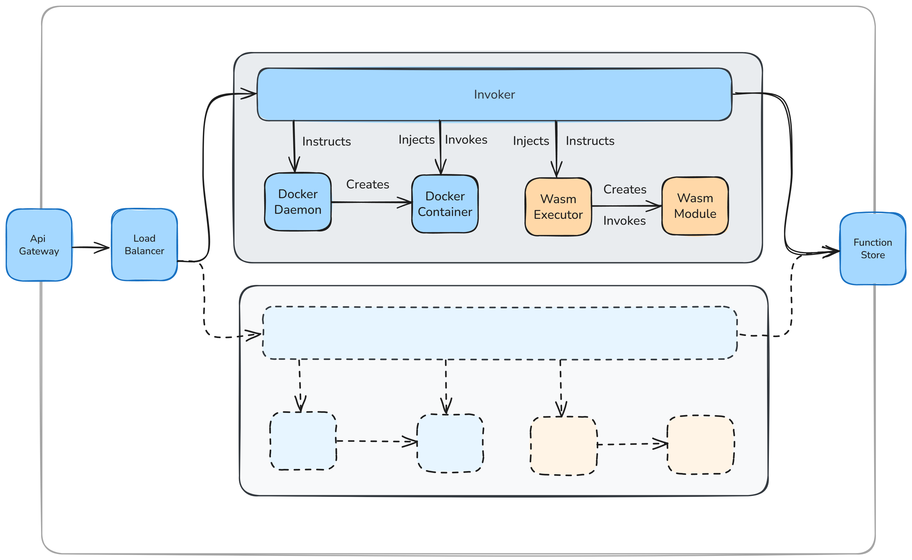

# Hybrid OpenWhisk Invoker (WASM + Docker)  

This README describes how to build and run a custom OpenWhisk standalone JAR that supports both WebAssembly (WASM) and Docker runtimes in a single Invoker, with per-runtime idle-container timeouts.  

---

## Overview  

- No Docker-only or WASM-only external proxy is needed. Everything is handled in one process.  

- We modified the default OpenWhisk Invoker so that:  
  - **Docker** containers use a **10-minute** idle timeout (default).  
  - **WASM** containers use a **10-second** idle timeout (fast cold-start).

<br>

<br>

Build:
```bash
./gradlew clean :core:standalone:shadowJar -x copySwagger
```

Run:
```bash
java -jar core/standalone/build/libs/openwhisk-standalone-*-all.jar
```

[Original Readme](./README_ORIGINAL.md)
